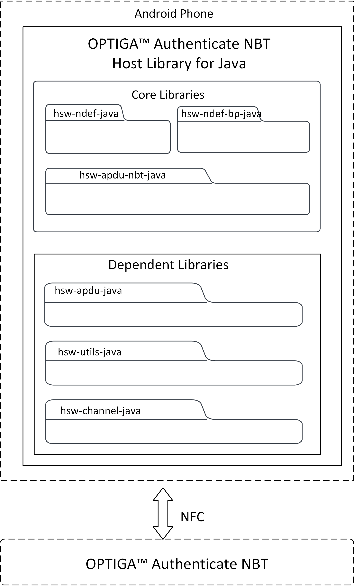
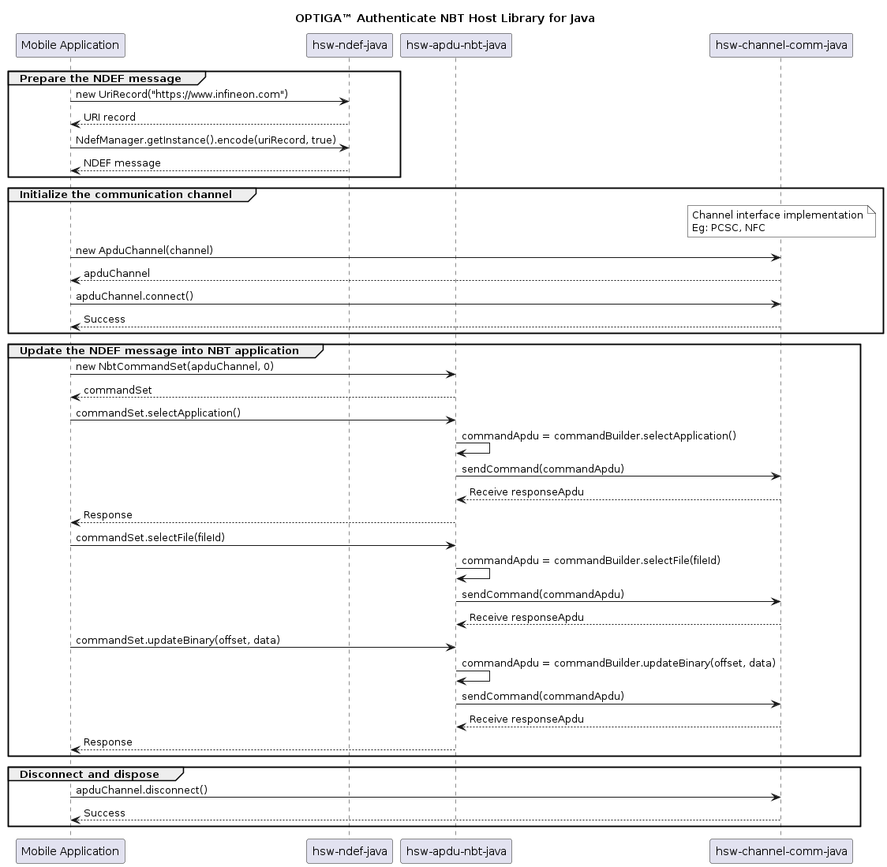

# OPTIGA&trade; Authenticate NBT Host Library for Java: User guide

The OPTIGA&trade; Authenticate NBT Host Library for Java offers an extensive API to interact with the OPTIGA&trade; Authenticate NBT and to utilize its full functionality. The host library is mainly intended to be used in Java/Android applications interfacing to the OPTIGA&trade; Authenticate NBT via NFC (for example: mobile phones or NFC readers).

## Scope and purpose

This guide describes the features and functionality of the OPTIGA&trade; Authenticate NBT Host Library for Java including architecture overviews of core libraries and basic descriptions. It also conveys the basic procedure to integrate the provided host library into existing Java and Android applications.

## Intended audience

This guide is primarily intended for:

- Android application developers who target to integrate the OPTIGA&trade; Authenticate NBT Host Library for Java into Android mobile phone apps
- Java application developers who target to integrate the OPTIGA&trade; Authenticate NBT Host Library for Java into desktop applications using NFC readers

## Quick navigation

- [Key features](#key-features)
- [Host library architecture](#host-library-architecture)
  - [Core libraries](#core-libraries)
  - [Dependent libraries](#dependent-libraries)
- [Directory structure](#directory-structure)
- [Gradle build system](#gradle-build-system)
- [Integrating into an existing project](#integrating-into-an-existing-project)
  - [Gradle based project](#gradle-based-project)
  - [Eclipse IDE project](#eclipse-ide-project)
- [Library interaction](#library-interaction)
- [Library usage](#library-usage)
- [References](#references)

## Key features

- Sends command APDUs (C-APDU) and receives response APDUs (R-APDU) from the OPTIGA&trade; Authenticate NBT
- Configuration of OPTIGA&trade; Authenticate NBT via its configurator application
- Personalization and operational commands to support simplified interaction with OPTIGA&trade; Authenticate NBT
- NDEF host library that enables the host application to build, encode, and decode NDEF records and messages
- NDEF host library that supports "NFC Forum well known type" and "NFC Forum external type"
- NDEF host library that provides brand protection supported NDEF records

## Host library architecture

This host library provides high-level command abstractions to communicate with the OPTIGA&trade; Authenticate NBT. It includes multiple sub-libraries in its package. The core libraries are designed to be platform-independent and they depend on a number of other libraries to provide their full functionality.

### Core libraries

The OPTIGA&trade; Authenticate NBT Host Library for Java contains three core libraries to interact with the OPTIGA&trade; Authenticate NBT.

- [hsw-apdu-nbt-java](../library/hsw-apdu-nbt-java/README.md)
- [hsw-ndef-java](../library/hsw-ndef-java/README.md)
- [hsw-ndef-bp-java](../library/hsw-ndef-bp-java/README.md)



#### hsw-apdu-nbt-java

This host library allows the application to send C-APDUs to the OPTIGA&trade; Authenticate NBT and receive R-APDUs from the OPTIGA&trade; Authenticate NBT. This library can be used with communication channels such as NFC, PCSC.

#### hsw-ndef-java

The NFC Data Exchange Format (NDEF) specification by [NFC Forum](https://nfc-forum.org/) defines a common data format to exchange information between NFC Forum devices. This library provides support to build and parse the NDEF messages, with support for common NDEF record type definitions. This library is extensible for an addition of new record type definitions.

#### hsw-ndef-bp-java

The NFC brand protection record library is an extension to the NDEF library to create and parse NFC brand protection records for the OPTIGA&trade; Authenticate NBT. This extended library includes NDEF records and parsers to provide the core brand protection functionality of the OPTIGA&trade; Authenticate NBT. Brand protection specific encoding and decoding are handled by the library itself. But this library depends on the hsw-ndef-java library for registering its records and for further NDEF record and message manipulations.

### Dependent libraries

The core libraries are dependent on several other libraries. A detailed description of these dependent libraries is provided below.

| Dependent&nbsp;libraries                                  | Description                                                                                                                                                                                                                       |
| --------------------------------------------------------- | --------------------------------------------------------------------------------------------------------------------------------------------------------------------------------------------------------------------------------- |
| [hsw-apdu-java](../library/hsw-apdu-java/README.md)       | This APDU library helps in building the APDU command bytes and parses the APDU response bytes according to the ISO/IEC 7816-4 specification.                                                                                      |
| [hsw-channel-java](../library/hsw-channel-java/README.md) | This dependent library provides the communication protocol interface for the OPTIGA&trade; Authenticate NBT APDU core library. This protocol provides interfaces such as initialize, transceive, and terminate to communicate with the OPTIGA&trade; Authenticate NBT. |
| [hsw-utils-java](../library/hsw-utils-java/README.md)     | This dependent library provides the utility methods such as byte conversions, string conversions, and bit operations.                                                                                                             |

## Directory structure

The directory structure of the OPTIGA&trade; Authenticate NBT Host Library for Java follows [pitchfork](https://github.com/vector-of-bool/pitchfork/blob/develop/data/spec.bs) layout including core and dependent libraries.

```text
hsw-nbt-java
|-- LICENSES/                       # Includes licenses used by the host library
|-- docs/                           # Includes user guide, images and the generated API reference
|-- gradle/                         # Includes Gradle wrapper configuration files
|-- library/                        # Includes the core and dependent libraries
|   |-- hsw-apdu-java/              # Dependent library
|   |-- hsw-apdu-nbt-java/          # Core library
|   |-- hsw-channel-java/           # Dependent library
|   |-- hsw-ndef-bp-java/           # Core library
|   |-- hsw-ndef-java/              # Core library
|   `-- hsw-utils-java/             # Dependent library
|-- .gitignore                      # Host library-specific gitignore file
|-- README.md                       # Overview of the OPTIGA&trade; Authenticate NBT Host Library for Java
|-- gradlew                         # Gradle wrapper Script
|-- gradlew.bat                     # Gradle wrapper Start up script for windows
`-- settings.gradle                 # Gradle project settings file
```

## Gradle build system

The OPTIGA&trade; Authenticate NBT Host Library for Java is integrated with [Gradle](https://gradle.org/) to ensure a smooth and consistent workflow for building Java and Android applications. The host library supports the following tools with the mentioned versions only:

- `Gradle version 8.3 and higher`
- `JDK version 1.8 and higher`

### Build as library

The OPTIGA&trade; Authenticate NBT Host Library for Java uses gradle to build.

```sh
# Build the code
.\gradlew build
```

### Documentation

The OPTIGA&trade; Authenticate NBT Host Library for Java API documentation is available in "docs/" folder.
For more information on the API, build [Javadoc](https://en.wikipedia.org/wiki/Javadoc) documentation. The Javadoc tool is installed as part of the Java Development Kit installation.

```sh
.\gradlew javadoc
```

The documentation will be put in a directory _\build\docs\javadoc_.

## Integrating into an existing project

Using Gradle as a build tool, integrating the host library into an existing project is straightforward. Here is how you can add the library as a dependency into a Java project:

### Gradle based project

Integrating into a Gradle-based project (for example: Android Studio project):

- Place the OPTIGA&trade; Authenticate NBT Host Library for Java into the folder of your existing application (for example: into the libs/ folder)
- Open existing application project's settings.gradle file
- Add the library path of all the needed modules in the settings.gradle file (make sure to use the correct path) for example:
  ```sh
  include('com.infineon.hsw.ndef')
  project(':com.infineon.hsw.ndef').projectDir = new File('app/libs/hsw-ndef-java')
  ```
- Open existing application project's build.gradle file
- Add library modules as a dependency, for example:
  ```sh
    dependencies {
  implementation project(':com.infineon.hsw.ndef')
  }
  ```
- Save the build.gradle file and sync your gradle project
- Once the library is successfully included, start using it in Java or Android application code by importing the necessary classes from library
  ```sh
  import com.infineon.hsw.nbt.ndef.records.RecordEncoder;
  ```

### Eclipse IDE project

To integrate OPTIGA&trade; Authenticate NBT Host Library for Java into Java or Android existing application in Eclipse IDE, follow the steps below.

- Open Eclipse IDE. Make sure that JDK is installed and configured in the Eclipse IDE.
- Open the application project
- Right click on the project
- Select Build Path
- Click on Configure Build Path
- Click on Libraries and select Add External JARs
- Select the jar file from the file explorer
- Click Apply and Close
- Then import the package name in source code and access the API
  ```sh
  import com.infineon.hsw.nbt.ndef.records.RecordDecoder;
  ```

## Library interaction

An example interaction between the core libraries is explained below with a use case - _Update URI data in an application file of the OPTIGA&trade; Authenticate NBT_. The hsw-ndef-java library is used to prepare a URI record and update it on the file system of the OPTIGA&trade; Authenticate NBT using the hsw-apdu-nbt-java library.



## Library usage

The usage of the host library's API to update a URI record in the OPTIGA&trade; Authenticate NBT application file is illustrated below.

1. Include the required headers from the OPTIGA&trade; Authenticate NBT Host Library for Java

    ```java
    // NDEF headers
    import com.infineon.hsw.ndef.IfxNdefMessage;
    import com.infineon.hsw.ndef.NdefManager;
    import com.infineon.hsw.ndef.records.rtd.UriRecord;
    import com.infineon.hsw.ndef.records.rtd.UriRecord.UriIdentifier;

    // APDU headers
    import com.infineon.hsw.apdu.nbt.NbtCommandSet;
    import com.infineon.hsw.apdu.nbt.NbtApduResponse;

    // communication protocol headers
    import com.infineon.hsw.apdu.ApduChannel;
    import com.infineon.hsw.apdu.ApduResponse;
    ```

2. Create a communication channel to interact with the OPTIGA&trade; Authenticate NBT

    ```java
    // Initialize the APDU channel with communication channel NFC
    ApduChannel apduChannel = new ApduChannel(channel);

    // Connect to the OPTIGA&trade; Authenticate NBT
    apduChannel.connect();
    ```

3. Update URI data in the application file of the OPTIGA&trade; Authenticate NBT with file ID 0xE104

    ```java
    // Build URI record
    UriRecord uriRecord = new UriRecord(UriIdentifier.URI_HTTPS_WWW, "infineon.com");

    // Encode the records into an NDEF message
    IfxNdefMessage message = new IfxNdefMessage(uriRecord);
    byte[] uriMessageBytes = NdefManager.getInstance().encode(message, true);

    // Create an instance of the NBT APDU command set
    NbtCommandSet commandSet = new NbtCommandSet(apduChannel, 0);

    NbtApduResponse apduResponse;
    apduResponse = commandSet.selectApplication();
    apduResponse.checkStatus(); // Checks SW success, else throws an exception
    apduResponse.getSW();   // Returns response status word

    apduResponse = commandSet.selectFile(0xE104);
    apduResponse.checkStatus();

    byte expected_len = (byte) 0x10;
    short offset = (short) 0x0000;
    apduResponse = commandSet.updateBinary(offset, uriMessageBytes);
    apduResponse.checkStatus();
    apduResponse.getData(); // Returns response data bytes
    ```

## References

- Infineon Technologies AG: *OPTIGA&trade; Authenticate NBT, Extended Datasheet*
