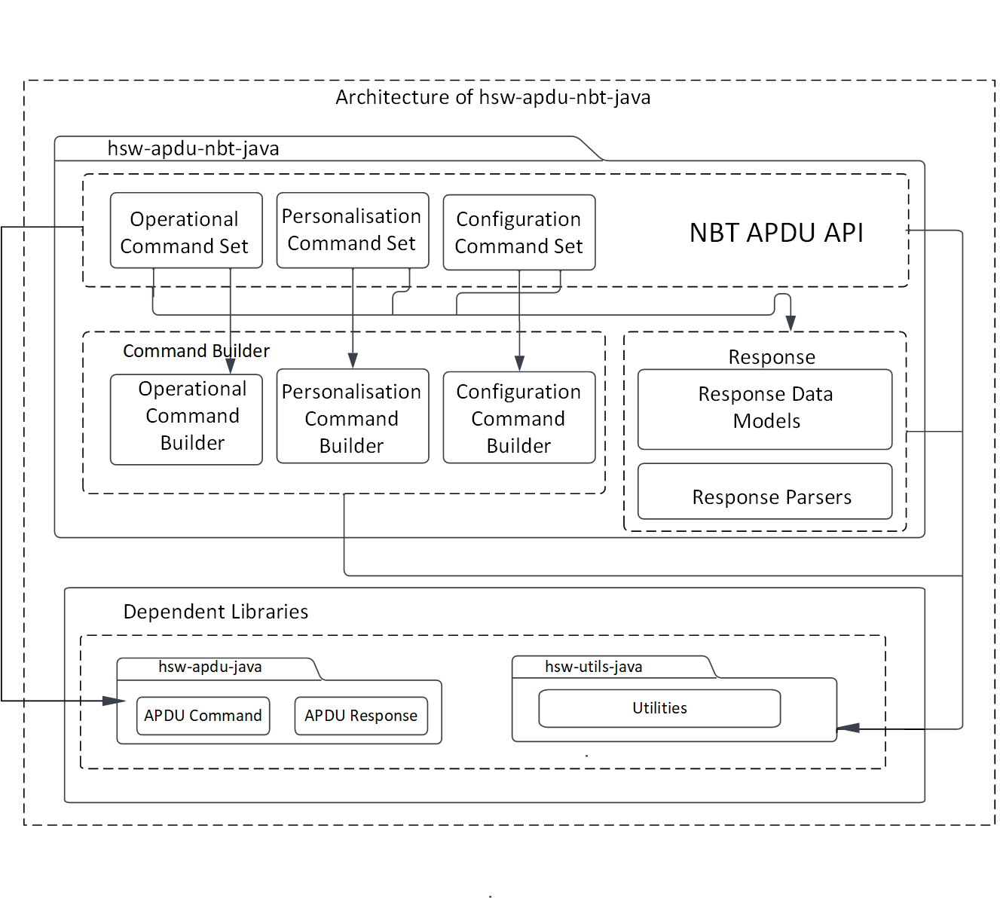
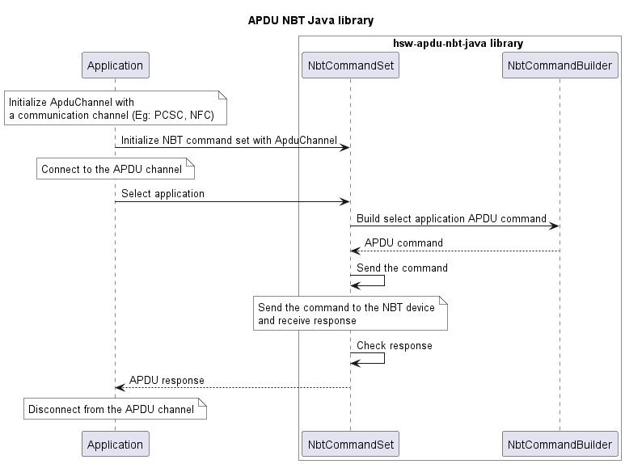

# NBT APDU Java Library

> Java library to communicate with the OPTIGA&trade; Authenticate NBT

The OPTIGA&trade; Authenticate NBT is a dynamic and secure turn-key solution for embedded NFC tag applications with varying levels of security and communication. The OPTIGA&trade; Authenticate NBT communicates with mobile phones or NFC readers via NFC and with host MCUs via I2C.

The NBT APDU library allows the host application to send C-APDUs and receive R-APDUs from the OPTIGA&trade; Authenticate NBT. This library can be used with any communication channel, such as NFC and PCSC.

To know more on the functions supported by this library, refer the API documentation. The API documentation can be generated using `gradle javadoc` command and documentation can be found in `build/docs/index.html`.

## Features

- Supports personalization and operational commands of the OPTIGA&trade; Authenticate NBT applet
- Configuration of OPTIGA&trade; Authenticate NBT via its configurator applet
- Extensible for any communication channel, such as NFC and PCSC

## Features not supported

- Pass-through APDUs

## Usage

1. Include the following headers

   ```java
   import com.infineon.hsw.apdu.nbt.NbtCommandSet;
   import com.infineon.hsw.apdu.nbt.NbtApduResponse;
   import com.infineon.hsw.utils.Utils;

   // Communication protocol
   import com.infineon.hsw.apdu.ApduChannel;
   import com.infineon.hsw.apdu.ApduResponse;
   ```

2. Initialize the command set

   ```java
   // Initialize the APDU channel with communication channel (For example, PCSC and NFC)
   ApduChannel apduChannel = new ApduChannel(channel);

   // Create an instance of the NBT APDU command set
   NbtCommandSet commandSet = new NbtCommandSet(apduChannel, 0);

   // Connect to the OPTIGA&trade; Authenticate NBT
   apduChannel.connect();
   ```

3. Communicate with the OPTIGA&trade; Authenticate NBT

   ```java
   // Execute commands
   NbtApduResponse apduResponse;

   apduResponse = commandSet.selectApplication();
   apduResponse.checkStatus(); // Checks SW success, else throws an exception
   apduResponse.getSW();   // Returns response status word

   apduResponse = commandSet.selectFile(CC_FILE_ID);
   apduResponse.checkStatus();

   byte expected_len = (byte) 0x10;
   short offset = (short) 0x0000;
   apduResponse = commandSet.readBinary(offset, expected_len);
   apduResponse.checkStatus();
   apduResponse.getData(); // Returns response data bytes
   ```

## Architecture

This image shows the software architecture of the library.



## Components

- **Command set**
  This command set acts as the API interface for the host application. This module is responsible for coordinating the building of APDU commands, sending the commands to the secure element through the communication interface, and receiving response from the secure element.

- **Command builder**
  The command builder helps in framing the command APDUs according to the OPTIGA&trade; Authenticate NBT's applet specification.

- **Response parser**
  The response parser helps in decoding the response APDUs including response data and status word according to the OPTIGA&trade; Authenticate NBT applet specification.

## Interaction

This UML sequence diagram describes the interaction between the components.



## Directory structure

The library directory is structured according to the Pitchfork Layout.

```text
hsw-apdu-nbt-java
|-- LICENSES/                       # Includes list of licenses used for the library package
|-- docs/                           # Includes images and the generated API reference
|-- gradle/                         # Includes gradle wrapper configuration files
|-- src/                            # Includes source files for the library
|-- .gitignore                      # Library specific gitignore file
|-- README.md                       # Overview of hsw-apdu-nbt-java library
|-- build.gradle                    # Includes gradle build commands
|-- gradle.properties               # Project specific Gradle properties
|-- gradlew                         # Gradle wrapper script
|-- gradlew.bat                     # Gradle start up configuration script for windows
`-- settings.gradle                 # Gradle project settings file
```

## Dependencies

- **hsw-apdu-java**
  The APDU library helps in building the APDU command bytes and parse the APDU response bytes according to the ISO/IEC 7816-4 specification.
- **hsw-utils-java**
  The utilities library provides the utility methods such as for byte conversions, string conversions, and bit operations.

## References

- Infineon Technologies AG: *OPTIGA&trade; Authenticate NBT, Extended Datasheet*
