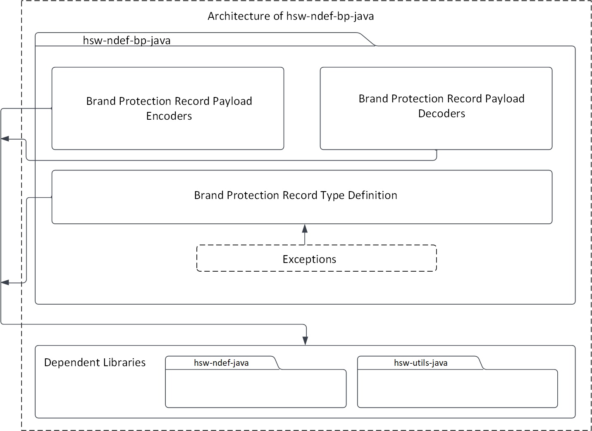
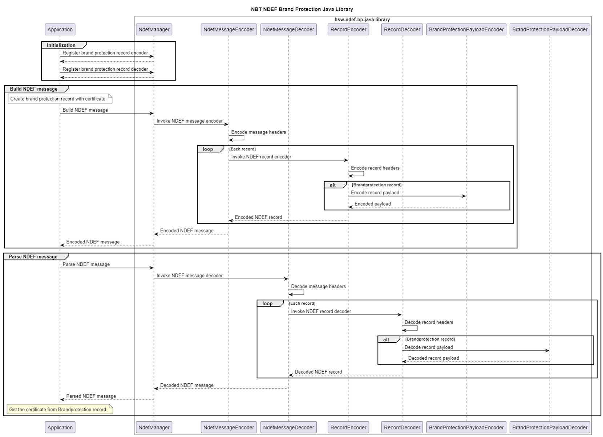

# NFC brand protection record library - Java

The NFC brand protection record library is an extension to the NDEF Java library to create and parse the NFC brand protection record.

The record type URN is `urn:nfc:ext:infineon.com:nfc-bridge-tag.x509`.

The brand protection record is created with the type `infineon.com:nfc-bridge-tag.x509`.

This record allows to pass x509 certificate in the payload. The payload passed to this library is not validated.

To know more on the functions supported by this library, refer the API documentation. The API documentation can be generated using `gradle javadoc` command and documentation can be found in `build/docs/index.html`.

## Usage

1. Register the brand protection encoder and decoder into the NDEF Java library

   ```java
   //Imports
   import com.infineon.hsw.ndef.bp.decoder.BrandProtectionRecordPayloadDecoder;
   import com.infineon.hsw.ndef.bp.encoder.BrandProtectionRecordPayloadEncoder;
   import com.infineon.hsw.ndef.NdefManager;
   import com.infineon.hsw.ndef.IfxNdefMessage;

   try{
   //Register the encoder and decoder
   NdefManager.registerEncoder(new RecordType(BrandProtectionRecord.BRAND_PROTECTION_RTD_TYPE),
   	new BrandProtectionRecordPayloadEncoder());
   NdefManager.registerDecoder(new RecordType(BrandProtectionRecord.BRAND_PROTECTION_RTD_TYPE),
   	new BrandProtectionRecordPayloadDecoder());
   }catch(Exception exception){
   	// Handle the exception here
   }
   ```

2. Use the brand protection record

   ```java
   // Build the record
   BrandProtectionRecord brandProtectionRecord = new BrandProtectionRecord(CERTIFICATE_DATA);

   // Encode into NDEF message
   IfxNdefMessage message = new IfxNdefMessage(brandProtectionRecord);
   NdefManager ndefManager = NdefManager.getInstance();
   byte[] messageBytes = ndefManager.encode(message);

   // Decode the encoded NDEF message
   IfxNdefMessage decodedMessage = ndefManager.decode(messageBytes);

   // Decode the record
   List<AbstractRecord> decodedRecords = decodedMessage.getNdefRecords();
   try {
   	BrandProtectionRecord decodedBrandProtectionRecord =
   		(UriRecord)ndefManager.decodeRecord(decodedRecords.get(0));

   	//Work with the record...

   } catch (NfcException e) {
   	// ...
   }
   ```

## Architecture

This image shows the software architecture of the library.



## Components

- **Brand protection record type definitions**

  These record type definitions (RTD) can be used to build the brand protection records.

- **Brand protection record payload encoders and decoders**

  The encoders and decoders component contains the brand protection payload encoders and decoders, which can be used to encode and decode the payload details into a byte array.

- **Utilities**

  This component contains the commonly used constants of this library.

- **Exceptions**

  The exceptions directory contains the exception types thrown by this library at runtime.

## Interaction

This UML sequence diagram describes the interaction between the components.



## Directory structure

The library directory is structured according to the Pitchfork Layout.

```
hsw-ndef-bp-java
|-- LICENSES/                       # Includes list of licenses used for the library package
|-- docs/                           # Includes images and the generated API reference
|-- gradle/                         # Includes gradle wrapper configuration files
|-- src/                            # Includes source files for the library
|-- .gitignore                      # Library specific gitignore file
|-- README.md                       # Overview of hsw-ndef-bp-java library
|-- build.gradle                    # Includes gradle build commands
|-- gradle.properties               # Project specific Gradle properties
|-- gradlew                         # Gradle wrapper script
|-- gradlew.bat                     # Gradle start up configuration script for windows
`-- settings.gradle                 # Gradle project settings file
```

## Dependencies

- **hsw-ndef-java**

  This dependent library creates and parses the NDEF records and messages.

- **hsw-utils-java**

  This dependent library contains the utilities to perform the byte array conversions.

## References

- Infineon Technologies AG: *OPTIGA&trade; Authenticate NBT, Extended Datasheet*
- NFC Data Exchange Format (NDEF), Technical Specification, NFC Forum™, NDEF 1.0
- NFC Record Type Definition (RTD), Technical Specification, NFC Forum™, RTD 1.0
