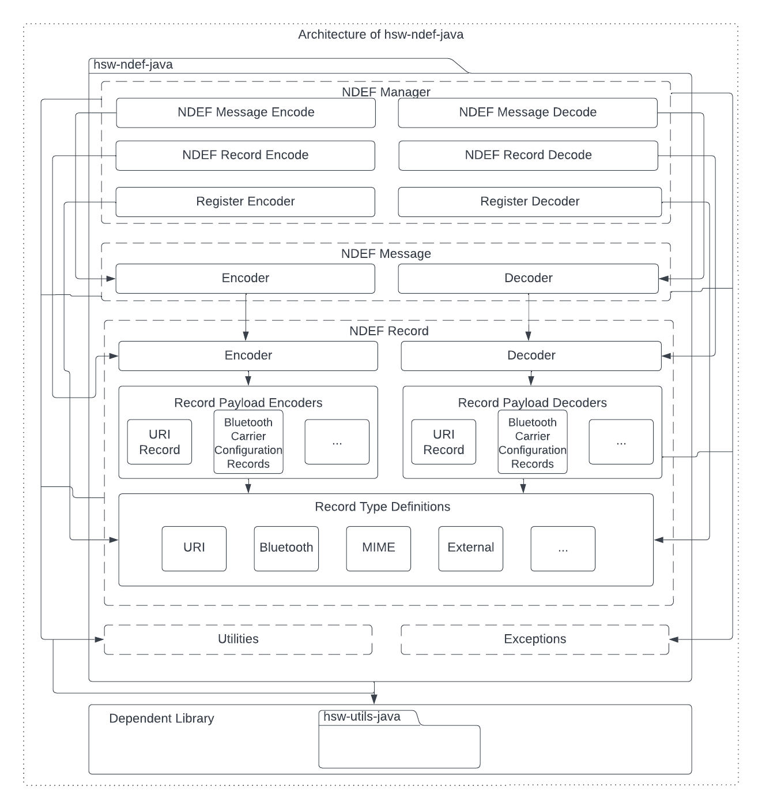
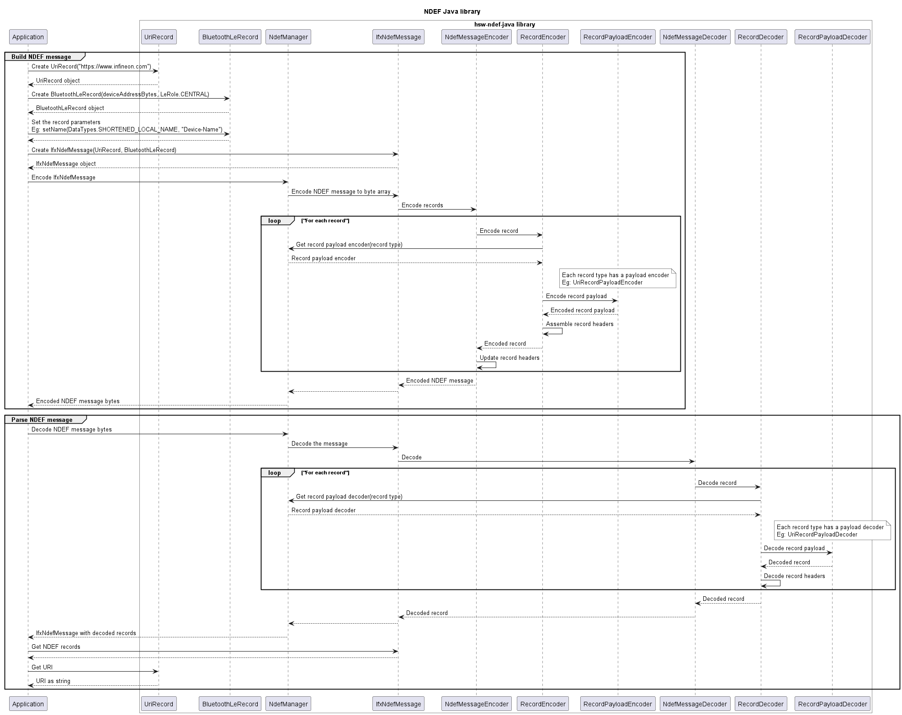

# NFC data exchange format (NDEF) library - Java

> Java library to encode and decode NDEF messages

The NFC data exchange format (NDEF) specification by [NFC Forum](https://nfc-forum.org/) defines a common data format to exchange information between NFC Forum devices. An NDEF message is composed of one or more NDEF records. Each NDEF record contains the record type information and a payload.

This Java library provides support to build and parse the NDEF messages, with support for common NDEF record type definitions. This library is extensible for addition of new record type definitions.

To know more on the functions supported by this library, refer the API documentation. The API documentation can be generated using `gradle javadoc` command and documentation can be found in `build/docs/index.html`.

## Features

- Build and parse the NDEF messages
- Build and parse the NDEF records
- Supported records:
  - URI record
  - Bluetooth connection handover records (For static connection handover)
    - Bluetooth record `(application/vnd.bluetooth.ep.oob)`
    - Bluetooth LE record `(application/vnd.bluetooth.le.oob)`
    - Handover select record
    - Alternative carrier record
    - Error record
  - MIME type record
  - External type record

## Features not supported

- Record chunks

## Usage

1. Include the following headers

   ```java
   import com.infineon.hsw.ndef.exceptions.NdefException;
   import com.infineon.hsw.ndef.IfxNdefMessage;
   import com.infineon.hsw.ndef.NdefManager;
   import com.infineon.hsw.ndef.records.AbstractRecord;
   import com.infineon.hsw.ndef.records.rtd.UriRecord;
   import com.infineon.hsw.ndef.records.rtd.UriRecord.UriIdentifier;
   import com.infineon.hsw.ndef.records.rtd.IfxNdefRecord;
   ```

2. Encode the URI record

   ```java
   // Build URI record
   UriRecord uriRecord = new UriRecord(UriIdentifier.URI_HTTPS_WWW, "infineon.com");

   // Build external type record
   byte[] extRecordType = "infineon.com:nfc-test".getBytes();
   byte[] extPayload = "Infineon Technologies".getBytes();
   IfxNdefRecord extRecord = new IfxNdefRecord(NdefConstants.TNF_EXTERNAL_TYPE, false, extRecordType, null, extPayload);
   ```

3. Encode the NDEF message

   ```java
   // Encode the records into an NDEF message
   IfxNdefMessage message = new IfxNdefMessage(uriRecord, extRecord);

   NdefManager ndefManager = NdefManager.getInstance();
   byte[] messageBytes =	ndefManager.encode(message);
   byte[] messageBytesWithLen = ndefManager.encode(message, true);
   ```

4. Decode the NDEF message

   ```java
   // Decode the encoded NDEF message
   IfxNdefMessage decodedMessage = ndefManager.decode(messageBytes);
   ```

5. Decode the URI record

   ```java
   // Decode the records
   List<AbstractRecord> decodedRecords = decodedMessage.getNdefRecords();
   try {
   	UriRecord decodedUriRecord = (UriRecord) ndefManager.decodeRecord(decodedRecords.get(0));
   	IfxNdefRecord decodedExtRecord = (IfxNdefRecord) ndefManager.decodeRecord(decodedRecords.get(1));

   	// Work with the records
   	String decodedUriRecordIdentifier = decodedUriRecord.getUriWithIdentifier();
   	byte[] decodedExtRecordPayload = decodedExtRecord.getPayload();
   	byte[] decodedExtRecordType = decodedExtRecord.getRecordType().getType();
   } catch (NdefException e) {
   	// catch exception here
   }
   ```

## Architecture

This image shows the software architecture of the library.



## Components

- **NDEF manager**

  This component should be used by the application to encode/decode the NDEF messages and records. This class also provides methods to register the new record payload encoders and decoders to support the new record types.

- **NDEF message**

  This component holds a collection of NDEF records. This class can be used to build an NDEF message with records.

- **Record type definitions (RTD)**

  The RTD directory contains the record types that are in-built supported by the library. These record type definitions can be used to build the records. Example: `new UriRecord("https://www.infineon.com")`

- **NDEF record**

  This component contains the standard record details such as the record headers, type, and payload. This abstract record is inherited to `WellKnown`, `Mime`, and `ExternalType` records. These records can be used to build the new records.

- **Record payload encoders and decoders**

  The encoders and decoders component contains the payload encoders and decoders, which is used by the NDEF manager to encode and decode the payload details into a byte array.

- **Utilities**

  This component contains the commonly used constants of this library.

- **Exceptions**

  The exceptions directory contains the exception types thrown by this library at runtime.

## Interaction

This UML sequence diagram describes the interaction between the components.



## Directory structure

The library directory is structured according to the Pitchfork Layout.

```
hsw-ndef-java
|-- LICENSES/                       # Includes list of licenses used for the library package
|-- docs/                           # Includes images and the generated API reference
|-- gradle/                         # Includes gradle wrapper configuration files
|-- src/                            # Includes source files for the library
|-- .gitignore                      # Library specific gitignore file
|-- README.md                       # Overview of hsw-ndef-java library
|-- build.gradle                    # Includes gradle build commands
|-- gradle.properties               # Project specific Gradle properties
|-- gradlew                         # Gradle wrapper script
|-- gradlew.bat                     # Gradle start up configuration script for windows
`-- settings.gradle                 # Gradle project settings file
```

## Dependencies

- **hsw-utils-java**

  This dependent library contains the utilities to perform the byte array conversions.

## References

- NFC Data Exchange Format (NDEF), Technical Specification, NFC Forum™, NDEF 1.0
- NFC Record Type Definition (RTD), Technical Specification, NFC Forum™, RTD 1.0
- URI Record Type Definition (RTD), Technical Specification, NFC Forum™, RTD-URI 1.0
- Connection Handover, Technical Specification, NFC Forum™, CH 1.4
- Bluetooth Secure Simple Pairing Using NFC, Application Document, NFC Forum™, BTSSP 1.3
